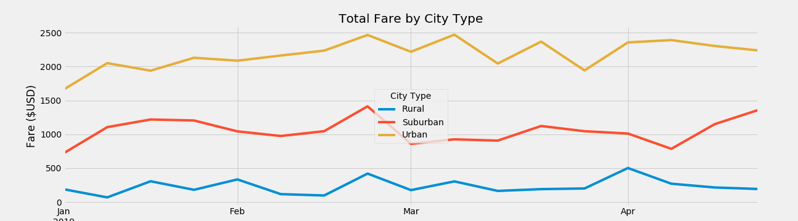

# jmerkel_Module_5
MatPlotLib

### Summary Data Frame
The summary Data Frame shows an interesting range of Average Fare prices, due in large part to the ratio of rides provided to amount of drivers. The frame shows that there were 6x as many drivers in suburban cities to rural, and over 30x as many drivers in urban cities compared to the rural cites. Unfortunately, the amount of drivers in more dense cities outpaced the number of rides requested. Bringing averages down.

The Average Fare per RURAL driver is nearly 4x as high as an Urban driver because there are so few drivers in Rural cities. On average, each Rural driver provided about 2 rides over the time period. In urban cities on the other-hand, drivers outnumbered the number of rides given (3 drivers per 2 rides), showing that high supply to the demand for rides brought the average fare per driver down.

### Total Fare by City Type

The chart illustrates more top level data of the period between Jan 2019 through April 2019. The data isn't particularly surprising as most ride fares each week came from Urban cities. Overall, around 60% of each weeks total fares comes from the urban cites,  around 30% comes from suburban cities, and less than 10% of all fares come from the rural cities.

Even though rides in the rural cities provide higher overall fare averages (for both fare itself and for the driver), the amount of fares from the rural cities is a small portion of total fare charges.
